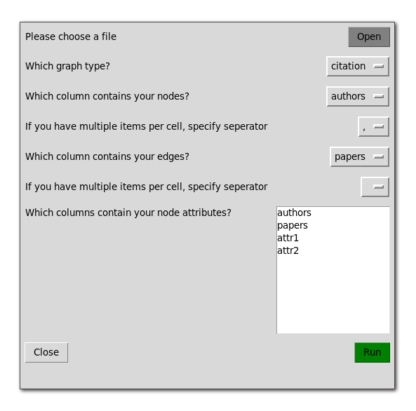

# edger
A scipy based tool to convert tabular data (csv) to network files (gexf) inspired by [Table2Net](https://medialab.github.io/table2net/).

## How to use
Clone this repo and go to folder

`git clone https://github.com/bipsen/edger`

`cd edger/`

Install requirements

`pip install -r requirements.txt`

Run gui

`python edger.py`

